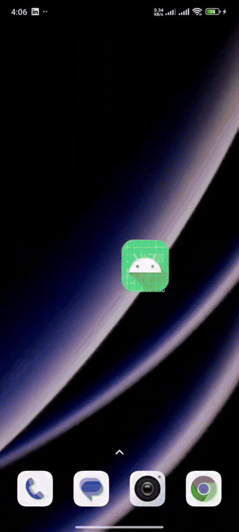

# ⚛️ PhysicsTodo - Interactive Physics-Driven Task Manager

**PhysicsTodo** is an innovative Android To-Do application built with **Jetpack Compose** that combines productivity with interactive 2D physics. Completing tasks causes the text characters to break apart and fall into a realistic sand pile at the bottom of the screen with gravity, realistic collisions, accelerometer-driven device tilt, and smooth return animations.

---

## 🎬 Demo

<p align="center">
  
</p>

> *Watch character particles disintegrate, fall under gravity, interact with device tilt, and float back to their original position when undone.*

---

## ✨ Features

- 🧩 **Particle Disintegration**: Checking off a task breaks the text string down into individual character particles.
- 🏖️ **Sand Stacking Physics**: Realistic 2D rigid-body physics simulation handling character-character collisions, elasticity, friction, and stacking at the bottom of the screen.
- 📱 **Hardware Accelerometer Integration**: Tilting your phone applies real-time directional gravity vectors (`tiltX`, `tiltY`) to the particle heap.
- 🔄 **Organic Return Animation**: Unchecking a task floats particles back to their original list row, preserving physics rotation during flight and snapping upright into place.
- ⚡ **High Performance & Battery Friendly**: Multi-substep physics engine (8 substeps / 480Hz accuracy) with automatic kinetic energy decay and idle sleeping state.

---

## 🛠️ Tech Stack & Architecture

- **Language**: Kotlin 100%
- **UI Framework**: [Jetpack Compose](https://developer.android.com/jetpack/compose) (Material 3, Custom Canvas Drawing)
- **Architecture**: MVVM (Model-View-ViewModel) + Unidirectional Data Flow
- **Asynchronous & Reactive**: Kotlin Coroutines & `StateFlow`
- **Sensors**: Android Hardware Accelerometer (`SensorManager`)
- **Graphics & Physics**: Custom 2D Rigid-body Physics Engine with Verlet / Euler integration and substep resolution.

---

## 🚀 Getting Started

### Prerequisites
- Android Studio Ladybug or newer
- JDK 17+
- Android SDK 24+ (Android 7.0 Nougat or higher)

### Installation
1. Clone the repository:
   ```bash
   git clone https://github.com/rjfahad44/PhysicsTodo.git
   ```
2. Open the project in **Android Studio**.
3. Sync Gradle and run the `:app` module on an Android Device or Emulator.

---

## 📂 Project Structure

```
com.bitbytestudio.physicstodo/
├── ui/
│   ├── models/
│   │   ├── CharacterAnchor.kt      # Individual character screen position metadata
│   │   ├── ParticleAnimation.kt    # Task particle lifecycle management
│   │   ├── ParticlePhase.kt        # State enum (FLOATING, FALLING, RESTING, RETURNING)
│   │   ├── TaskTextLayout.kt       # Task layout boundaries
│   │   └── TextParticle.kt         # Particle physics state (x, y, velocity, rotation)
│   ├── MotionSensor.kt             # Accelerometer listener and low-pass filter
│   ├── ParticleController.kt       # Multi-particle global physics engine loop
│   ├── TodoItem.kt                 # Task list row Compose item with text layout reporting
│   ├── TodoScreen.kt               # Main screen layout and particle overlay canvas
│   └── TodoViewModel.kt            # StateFlow task list state management
└── MainActivity.kt                 # Application entry point
```

---

## 📜 License

```
Copyright 2026 BitByTestudio

Licensed under the Apache License, Version 2.0 (the "License");
you may not use this file except in compliance with the License.
You may obtain a copy of the License at

    http://www.apache.org/licenses/LICENSE-2.0

Unless required by applicable law or agreed to in writing, software
distributed under the License is distributed on an "AS IS" BASIS,
WITHOUT WARRANTIES OR CONDITIONS OF ANY KIND, either express or implied.
See the License for the specific language governing permissions and
limitations under the License.
```
